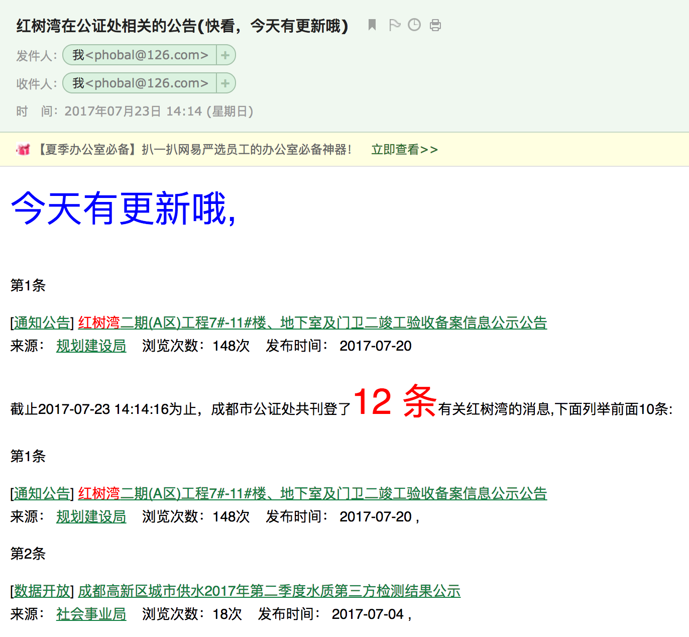

## 定期爬取成都市公证处网站有关“红树湾”的公告

### 缘由：

近期位于成都市高新区府兴路51号红树湾三期B区的开发商，在未通知业主的情况下准备将原规划的商业更改为住宅，而此次调整规划通知仅仅只是通过规划局将该公告挂在成都市公证处，作为普通老百姓谁没事儿跑去那上面闲逛呢，所以严重造成信息不对称。

基于此，作为业主的我有义务为邻居做点什么，结合自己的职业--程序猿，所以我想到了我可以写一个爬虫，定期去爬取成都市公告处的网站，然后将所有有关红树湾的关键词给搜索出来，然后进行如下过程：  
* 数据获取  
先爬取<http://www.cdht.gov.cn/search.jspx?q=%E7%BA%A2%E6%A0%91%E6%B9%BE>这个地址下的搜索结果页；
* 数据清洗  
对上一步获取的数据进行清洗，主要是去判断今天是否有发布最新的消息  
* 发送邮件  
对上一步清洗的数据做一个判断，如果今天有新的公告，那么就开始群发邮件
效果如下:

- 使用的技术  
[superagent](https://github.com/visionmedia/superagent): 主要用于模拟浏览器发送http请求，并返回请求结果  
[cheerio](https://github.com/cheeriojs/cheerio)  服务器端的jQuery，对爬取的网页元素进行各种类似jQuery对浏览器的操作  
[nodemailer](https://github.com/nodemailer/nodemailer) 使用node发送邮件的库 

### TODO

1、通过shell脚本定时爬取网站  
2、将爬取的结果发送到QQ群中 

